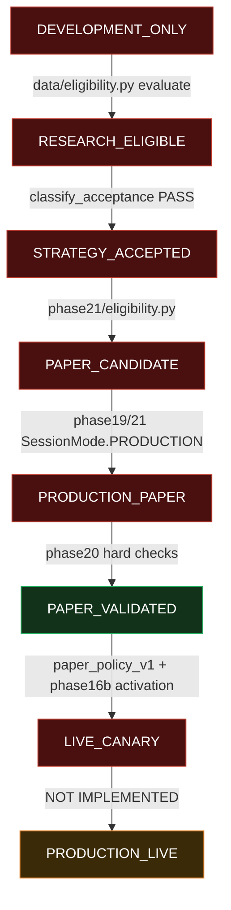

# Next-Stage Gap Analysis (AUDIT-ONLY)

> Read-only repository audit. **No code was modified. No gate was weakened. No paper or live trading was enabled. No broker order-placement function was executed.**

This document traces the full promotion state machine and, for every transition, records the implementing code, required gates, required artifacts, enforcing tests, current gate values, why the system is blocked, and what is genuinely missing versus already built.

Machine-readable companion: [`reports/next_stage_gap_analysis.json`](../reports/next_stage_gap_analysis.json).

---

## Executive summary

The promotion ladder is implemented as a **layered gate stack**, not a single enum FSM:

1. **Dataset rung** — `EligibilityLevel` + `ResearchEligibilityChecker` (`data/eligibility.py`, `data/policy.py`)
2. **Strategy rung** — `score_policy_v1` + `classify_acceptance` + `StrategyAcceptanceRecord` (`research/scoring.py`, `phase17a/pipeline.py`, `research/acceptance_record.py`)
3. **Paper-candidacy rung** — `PaperEligibilityGate` + `PAPER_CANDIDATE` (`paper/eligibility.py`, `phase21/eligibility.py`)
4. **Operational validation** — Phase 20 `PAPER_VALIDATED` / Phase 21 `PAPER_QUALIFIED`
5. **Live-canary rung** — `paper_policy_v1` + `LiveTradingEligibilityGate` + Phase 16B activation
6. **Production live** — **not implemented** (highest phase is `phase21`; no `phase22+`)

**The single root blocker is data provenance/certification**, which cascades down the entire ladder:

- Zerodha historical data certifies as **`DEVELOPMENT_ONLY`** (source is `non_exchange` / `DEVELOPMENT_DATA`, no PIT universe membership ledger, delisted coverage `unknown`, ISIN/instrument identity incomplete, calendar residual quality ERRORs).
- `development_only` datasets **cannot be research-accepted** (hard block in `classify_acceptance` and `score_policy_v1`), so `accepted = 0`.
- With no accepted strategy, `research_accepted = false` and `paper_eligible = false`, so `PAPER_CANDIDATE = false`.
- Phase 20 `PAPER_VALIDATED` is achieved, but only for a **buy-and-hold activity probe in `INFRASTRUCTURE_SANDBOX`** — it validates operational/safety infrastructure, not a research-accepted strategy.

The trading, validation, recovery, and safety code **largely exists and is correctly gated off**. The work required to advance is **data acquisition + certification**, not more paper/live trading code.

---

## State machine



Legend: red = blocked at current state, green = currently satisfied (sandbox probe), orange = not implemented.

---

## Transition 1 — `DEVELOPMENT_ONLY → RESEARCH_ELIGIBLE`

- **Code:** `src/quantfund/data/eligibility.py:46-233` (`ResearchEligibilityChecker.evaluate`); levels in `data/policy.py:11-16`; Zerodha facts in `phase17c/certify_gate.py:38-72`.
- **Artifacts:** `reports/phase17c_dataset_certification.json`, per-symbol `data/research/zerodha/<pkg>/v2/certification.json`.
- **Tests:** unit tests over `data/eligibility.py`, `phase17c/certify_gate.py`, `data/policy.py`, plus `zerodha_shortcut == false` assertion.

| Gate | Required | Current | Pass |
|------|----------|---------|------|
| `source_grade` | exchange / paid | `non_exchange` | ❌ |
| `capability_source_bar_ok` | true | false | ❌ |
| `data_class` | not `DEVELOPMENT_DATA` | `DEVELOPMENT_DATA` | ❌ |
| `calendar_verified` | true | true | ✅ |
| quality `error_count` | 0 | 13–14 (`bar_on_closed_session`, `missing_open_session`) | ❌ |
| `corporate_action_coverage` | `splits_bonus_dividends` / `full_verified` | `splits_bonus_dividends` (17C) / `unknown` (validation path) | ⚠️ |
| `universe_completeness` | `partial_pit` / `full_pit` | `current_snapshot_only` | ❌ |
| `membership_coverage_ratio` | ≥ 1.0 | 0.0 | ❌ |
| `unknown_membership_session_count` | 0 | ~2133–2134 | ❌ |
| `delisted_coverage` | partial / complete | `unknown` | ❌ |
| `instrument_identity_issues` | 0 | 2 | ❌ |

**Blocked because:** the Zerodha source is non-exchange development data with no point-in-time universe ledger, no delisting ledger, incomplete ISIN/instrument identity, and residual calendar quality ERRORs.

**Exists:** the full eligibility checker, thresholds, per-symbol certification artifacts, and honest facts assembly (no Zerodha shortcut).
**Missing:** exchange/paid source authority; PIT universe membership ledger; delisted/terminal-event ledger; stable ISIN + instrument_token in certified packages; zero-residual calendar reconciliation.

---

## Transition 2 — `RESEARCH_ELIGIBLE → STRATEGY_ACCEPTED`

- **Code:** `phase17a/pipeline.py:202-218` (`classify_acceptance`); `research/scoring.py:10-95` (`score_policy_v1`); `phase18/pipeline.py:339-352`; `research/acceptance.py:54-140`; `research/acceptance_record.py:98-136`.
- **Artifacts:** `reports/phase17a_strategy_validation.json`, `reports/phase18_strategy_search.json` (`candidates.accepted`), `reports/phase18_leaderboard.json`, and an immutable `StrategyAcceptanceRecord` (which **cannot** be created for `development_only`).
- **Tests:** acceptance classifier, scoring policy, Phase 18 finalist evaluation, acceptance-record guards, walk-forward / robustness / leakage / reproducibility.

| Gate | Required | Current | Pass |
|------|----------|---------|------|
| dataset not `development_only` | research_eligible / production_candidate | development_only | ❌ (hard block) |
| excess Sharpe vs buy-and-hold | ≥ −0.25 | n/a (blocked earlier) | ❌ |
| robustness not fragile | pass_rate ≥ 0.5; no sign-flip @ ≥2× cost | generally passes | ⚠️ |
| walk-forward positive fraction | ≥ 0.40 (campaign path) | engine runs; floor only on campaign path | ⚠️ |
| no leakage | as-of / next-bar-open PASS; TEST sealed | PASS | ✅ |
| reproducibility | identical hashes | PASS | ✅ |
| DSR / trial accounting | finite DSR + trial count (no hard min) | computed; soft only | ⚠️ |

**Blocked because:** `classify_acceptance` hard-returns `FAIL` for `development_only`, and `score_policy_v1` forces `accepted = False`. Current report: `accepted = 0`, `paper_candidates = 0`.

**Exists:** the entire acceptance stack — scoring, DSR/trial accounting, walk-forward engine, robustness suite, leakage tests, reproducibility, campaign policy, immutable acceptance record.
**Missing:** a research-eligible dataset to feed it. Note: embargo/purge are defined but default `0` (unused); DSR is soft (no hard minimum DSR / absolute Sharpe / p-value gate — no PBO/Bonferroni/haircut).

---

## Transition 3 — `STRATEGY_ACCEPTED → PAPER_CANDIDATE`

- **Code:** `phase21/eligibility.py:49-89` (`evaluate_strategy_for_phase21`); `paper/eligibility.py:75-158` (`PaperEligibilityGate`); `phase19/selection.py:49-121`.
- **Artifacts:** `reports/phase18_strategy_search.json` with `candidates.accepted > 0` and finalist `decision == "PASS"`; `reports/phase21_paper_qualification.json`.
- **Tests:** `phase21/eligibility.py`, `paper/eligibility.py`, Phase 19 production-paper blocking.

| Gate | Required | Current | Pass |
|------|----------|---------|------|
| `candidate.research_accepted` | true | false | ❌ |
| `PaperEligibilityGate.paper_eligible` | true | false | ❌ |
| `certified_eligibility` | research_eligible / production_candidate | development_only | ❌ |
| `acceptance_evidence_id` | present | null | ❌ |
| `session_mode` | PRODUCTION | INFRASTRUCTURE_SANDBOX | ❌ |
| selection mode | PRODUCTION_PAPER_ELIGIBLE | BLOCKED_NO_ACCEPTED_STRATEGY | ❌ |

**Current value:** `PAPER_CANDIDATE = false` (confirmed in `reports/phase21_paper_qualification.json`).
**Blocked because:** all three required conditions fail — no acceptance, no paper eligibility, sandbox mode.

**Exists:** `PAPER_CANDIDATE` computation and the full `PaperEligibilityGate` (sealed test, robustness, walk-forward, DSR, leakage, risk/exec, operator sub-gates).
**Missing:** upstream research acceptance + `acceptance_evidence_id`, and production session wiring.

---

## Transition 4 — `PAPER_CANDIDATE → PRODUCTION_PAPER`

- **Code:** `phase19/pipeline.py:146-153` and `phase21/pipeline.py:173-178` (SessionMode.PRODUCTION selection); `phase19/activation.py:79-80`; `paper/session.py:132-140`.
- **Tests:** Phase 19 production blocking, `paper/session.py` production gate, `phase19/activation.py`.

| Gate | Required | Current | Pass |
|------|----------|---------|------|
| `mode == PRODUCTION_PAPER_ELIGIBLE` | true | false | ❌ |
| `candidate.research_accepted` | true (else `production_paper_blocked_without_acceptance`) | false | ❌ |
| `eligibility.paper_eligible` | true (else `ValueError` in `PaperSession`) | false | ❌ |

**Current value:** runs in `INFRASTRUCTURE_SANDBOX`; production paper is not entered.
**Blocked because:** with no accepted strategy, selection returns sandbox mode and production-paper is refused by design.

**Exists:** production-paper mode, hard blocking guards, activation scaffolding.
**Missing:** an accepted candidate to legitimately enter production paper.

---

## Transition 5 — `PRODUCTION_PAPER → PAPER_VALIDATED`

- **Code:** `phase20/pipeline.py:342-382` (checks + hard gate + `PAPER_VALIDATED`); `phase20/stress.py` (stress suite); `phase21/pipeline.py:485-511` (`PAPER_QUALIFIED` / `PAPER_INSUFFICIENT_ACTIVITY`).
- **Artifacts:** `reports/phase20_paper_validation.json`, `docs/PHASE20_PAPER_VALIDATION.md`, per-run unique journal/checkpoint under `experiments/phase20/`.
- **Tests:** `tests/unit/test_phase20_paper_validation.py` (65 tests, incl. new state-isolation + duplicate-event regression).

All nine hard checks currently **pass**: `duration_completed`, `reconciliation_clean_or_halted`, `no_live_orders`, `place_order_called_zero`, `strategy_immutable`, `drift_within_limits`, `stress_suite_passed`, `no_safety_violations`, `recovery_trusted_or_halted`.

**Current value:** `PAPER_VALIDATED` (3 consecutive runs). Profitability is informational (Trades = 1, PnL ≈ ₹4,056, ≈ 4.06%).

> **Important caveat:** Phase 20 currently runs in `INFRASTRUCTURE_SANDBOX` with `certified_eligibility = development_only` and a **buy-and-hold activity probe**. `PAPER_VALIDATED` here proves the operational / safety / recovery infrastructure works — it is **not** research-grade production-paper validation of an accepted strategy.

**Exists:** the `PAPER_VALIDATED` gate, stress suite, recovery, per-run session isolation, safety assertions.
**Missing:** validation of an actually research-accepted strategy on a research-eligible dataset.

---

## Transition 6 — `PAPER_VALIDATED → LIVE_CANARY`

- **Code:** `phase16b/session.py`, `phase16b/gates.py:65-152`, `phase16b/activation.py:15`, `phase16b/broker.py:74-76`; `research/paper_policy.py:172-177`; `research/promotion.py:330-337`; `execution/live_eligibility.py:45-118`.
- **Artifacts:** `CanaryActivationRecord`, `phase16b_journal.jsonl`, paper-policy live-eligibility evidence.
- **Tests:** Phase 16B gates/session/broker/flags, `research/paper_policy.py`, `promotion.py`, `execution/live_eligibility.py`.

| Gate | Required | Current | Pass |
|------|----------|---------|------|
| `paper_policy_v1_passed` | min_trades ≥ 3, max_dd ≤ 0.25 | not reached | ❌ |
| `live_eligibility_candidate` | true | false | ❌ |
| canary activation record | confirm phrase `I_CONFIRM_CONTROLLED_LIVE_CANARY` | absent | ❌ |
| `live_trading_flag.enabled` | explicit true (env alone insufficient) | DISABLED | ❌ |
| kill switch disarmed for canary | explicit disarm | ARMED | ❌ |
| pre-trade gates | activation + allowlist + limits + recon + market data | not evaluated | ❌ |

**Blocked because:** no accepted strategy, no paper-policy pass, no activation record, live flag DISABLED, kill switch ARMED. `scripts/run_phase16b_live_canary.py:72-79` refuses real-network submission by default.

**Exists:** the full Phase 16B canary stack — one-shot authorized `place_order`, pre-trade gate stack, kill-switch integration, activation confirm phrase, tiny canary limits.
**Missing:** any automated link from `PAPER_VALIDATED`/`PAPER_QUALIFIED` to canary; requires upstream acceptance plus explicit human activation.

---

## Transition 7 — `LIVE_CANARY → PRODUCTION_LIVE`  (NOT IMPLEMENTED)

- **Scaffolding only:** `production/activation.py:16-155` (9-gate activation, `orders_authorized` default false), `production/controls.py:62-63`, `production/connectivity.py:69-89` (`_GuardTransport` blocks order mutations), `execution/modes.py:16-74` (`OFF` default, `BROKER_LIVE` multi-gated), `scripts/enable_live_trading.py` (writes record; `ORDER SUBMISSION: NOT EXECUTED`).

| Gate | Required | Current | Pass |
|------|----------|---------|------|
| `GLOBAL_KILL_SWITCH_OFF` | true | ARMED | ❌ |
| `execution_mode == BROKER_LIVE` | 7+ independent gates | OFF | ❌ |
| `allow_live_send` | true (permanently blocked in Phase 9 v1) | false / blocked | ❌ |
| `auto_graduate_to_live` | true | false | ❌ |

**Blocked because — genuinely not implemented.** There is no `prod_live` module, no deployment-stage enum, no automated canary→full-live bridge, and no unrestricted order-submission runtime. `ASSUMPTIONS.md` explicitly lists automatic canary→full-live promotion as out of scope. Highest phase in the repo is `phase21`; **no `phase22+` exists**.

**Exists:** activation scaffolding, execution-mode enum, HTTP guard transport, kill-switch controls.
**Missing:** the entire production-live order-submission runtime + human-gated ramp/rollout state machine.

---

## Focus-gate matrix

| Focus item | Required | Current | Pass | Primary code |
|------------|----------|---------|------|--------------|
| `source_grade` | exchange/paid | non_exchange | ❌ | `data/providers/zerodha_historical.py:104-108`; `data/eligibility.py:73-76` |
| `capability_source_bar_ok` | true | false | ❌ | `data/providers/capabilities.py:61-71`; `phase17c/certify_gate.py:60` |
| CA completeness | splits_bonus_dividends+ | splits_bonus_dividends / unknown | ⚠️ | `data/corporate_actions/coverage.py:71-119`; `data/eligibility.py:98-103` |
| PIT universe membership | partial/full_pit, ratio≥1.0, 0 unknown | current_snapshot_only, 0.0, ~2134 | ❌ | `phase17c/identity_pit.py:60-79`; `data/eligibility.py:108-132` |
| ISIN / instrument identity | issues=0 | issues=2 | ❌ | `data/identity.py:20-30`; `phase17c/identity_pit.py:30-32` |
| Delisted coverage | partial/complete | unknown | ❌ | `data/instruments/coverage.py:42-127`; `data/eligibility.py:134-140` |
| Calendar residuals | verified + 0 ERRORs | verified, 13–14 ERRORs | ❌ | `data/calendar/nse.py:19-93`; `data/quality/checks.py:296-402` |
| Strategy acceptance thresholds | excess Sharpe ≥ −0.25, not dev_only | blocked (accepted=0) | ❌ | `research/scoring.py:45-95`; `phase17a/pipeline.py:202-218` |
| DSR / trial accounting | finite DSR + trials (no hard min) | soft only | ⚠️ | `research/multiple_testing.py:13-49`; `research/scoring.py:81-84` |
| Walk-forward | ≥40% positive windows (campaign) | engine runs; embargo/purge unused | ⚠️ | `research/walkforward.py:54-61`; `research/splits.py:37-38` |
| Robustness | pass_rate≥0.5, not fragile | passes when run | ⚠️ | `research/robustness.py:39-77` |
| Leakage | as-of/next-bar PASS, TEST sealed | PASS | ✅ | `phase17a/pipeline.py:68-170`; `phase18/seal.py:32-46` |
| Reproducibility | identical hashes | PASS | ✅ | `phase17a/pipeline.py:173-199`; `phase18/pipeline.py:404-411` |
| Paper-candidate rules | accepted ∧ eligible ∧ prod mode | false | ❌ | `phase21/eligibility.py:56-60` |

---

## What is genuinely missing vs already built

**Already built (and correctly gated):** dataset certification lattice, research acceptance stack (scoring, DSR, walk-forward, robustness, leakage, reproducibility), immutable acceptance records, paper eligibility gate, Phase 19/20/21 paper pipelines, Phase 20 stress + recovery + unique-session isolation, Phase 16B live-canary safety stack, production activation scaffolding, broker write guards, kill switch.

**Genuinely missing:**
1. Exchange/paid research-grade data source authority.
2. Point-in-time universe membership ledger.
3. Delisting / terminal-event ledger (delisted coverage).
4. Stable ISIN + instrument_token identity in certified packages.
5. Zero-residual calendar reconciliation.
6. A `StrategyAcceptanceRecord` (impossible until dataset is research-eligible).
7. Production-live runtime (`phase22+`): deployment-stage enum, ramp/rollout state machine, unrestricted order engine — out of scope today.

---

## Required next phase

**The next phase is a DATA-SOURCE + CERTIFICATION upgrade, not more trading code.** Ordered:

1. Acquire exchange-grade or paid research-grade data authority → fixes `source_grade`, `capability_source_bar_ok`, `data_class`.
2. Build a point-in-time universe membership ledger → fixes `universe_completeness`, `membership_coverage_ratio`, `unknown_membership_session_count`.
3. Add a delisting / terminal-event ledger → delisted coverage partial/complete.
4. Populate stable ISIN + instrument_token identity → fixes `instrument_identity_issues`.
5. Reconcile calendar residuals to zero quality ERRORs.
6. Re-certify → target `RESEARCH_ELIGIBLE`, and wire `decision.level.value` into pipelines instead of the hard-coded `development_only`.
7. Run Phase 17/18 acceptance on the eligible dataset → accepted strategies + `StrategyAcceptanceRecord` + `acceptance_evidence_id`.
8. Enter PRODUCTION paper (Phase 19/21) with `PAPER_CANDIDATE = true`; validate via Phase 20 on the accepted strategy (not the sandbox probe).
9. Only then consider Phase 16B live canary under explicit human activation. Production-live remains net-new (`phase22+`) and out of scope now.

---

## Final status

```
CURRENT_STATE        : DEVELOPMENT_ONLY (dataset) | accepted_strategies=0 | PAPER_CANDIDATE=false
                       Phase20=PAPER_VALIDATED (sandbox buy-and-hold probe, x3 consecutive)
                       Phase21=PAPER_INSUFFICIENT_ACTIVITY
BLOCKING_GATES       : source_grade=non_exchange; capability_source_bar_ok=false;
                       data_class=DEVELOPMENT_DATA; universe_completeness=current_snapshot_only;
                       membership_coverage_ratio=0.0 (~2134 unknown sessions);
                       delisted_coverage=unknown; instrument_identity_issues=2;
                       calendar quality ERRORs=13-14; research acceptance impossible on development_only
MISSING_ARTIFACTS    : PIT universe membership ledger; delisting/terminal-event ledger;
                       ISIN+instrument_token certified identity; exchange/paid certified dataset;
                       zero-residual calendar reconciliation; StrategyAcceptanceRecord+evidence_id;
                       phase18 candidates.accepted>0; CanaryActivationRecord;
                       production-live runtime (phase22+ absent)
REQUIRED_NEXT_PHASE  : Data-source upgrade + re-certification to RESEARCH_ELIGIBLE
                       (NOT more paper/live code). Then research acceptance -> production paper.
SAFETY_STATUS        : real_broker_orders=0; place_order_called=0; orders_submitted=0;
                       live_trading=DISABLED; broker_write_capability=DISABLED;
                       kill_switch=ARMED; paper_trading=simulation only; auto_graduate_to_live=false
```

_The fix scope is data provenance and certification; every trading safety gate remains intact and this audit changed no code._
